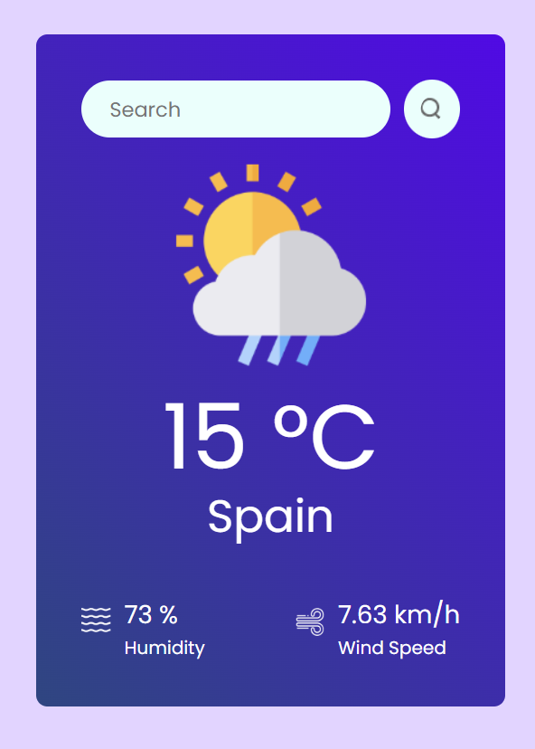

## Weather App Using ReactJS

Access current weather data for any location on Earth!
Using OpenWeather Api for Built-in API request by city name with reactJS.

## 🚀 DEMO

[Deploy](https://weatherApp.netlify.app/)
